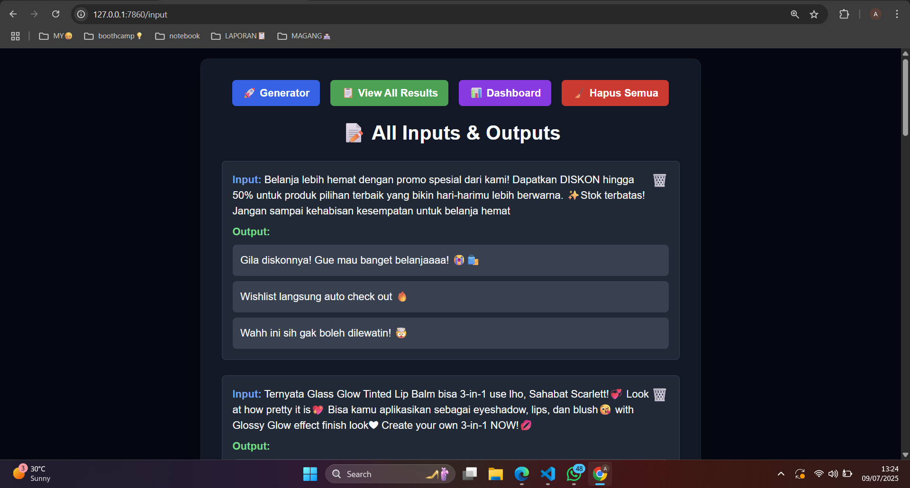
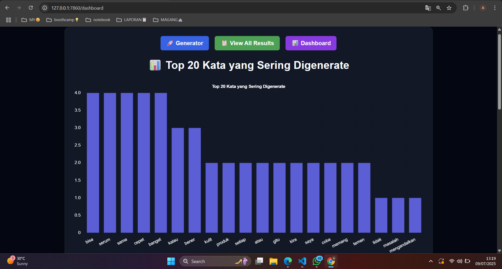
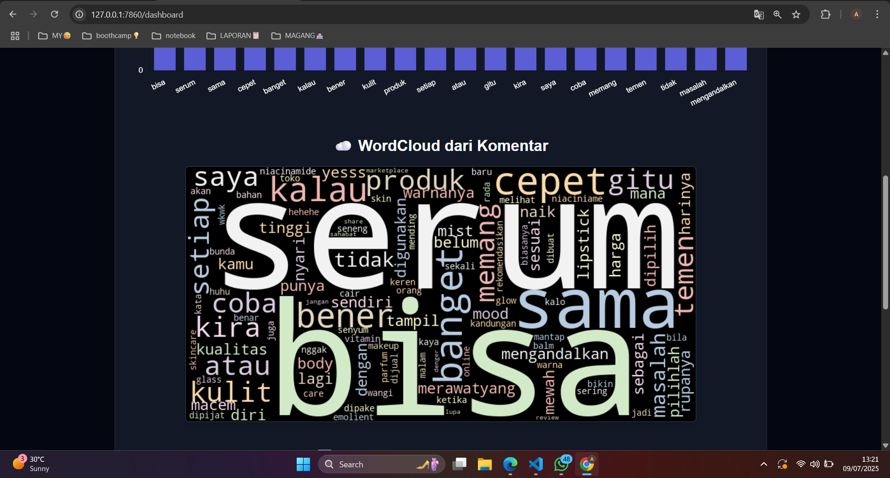

# 🌐 AI Comment Generator — Flask Web Application

This repository demonstrates how a **fine-tuned Large Language Model (LLM)** can be deployed into a **production-style web application** using **Flask and SQLite**.

The main focus of this project is **AI system integration** — translating a fine-tuned LLM into a usable product by handling inference, data flow, and persistence within a web-based system.





> 🔗 **Want to see how the model was built and fine-tuned?**  
> 👉 Model Development Repository:  
> https://github.com/aismaanly/ai-comment-generator

---

## 🎯 Project Objective

To build a **lightweight AI-powered web application** that:

* Accepts social media post descriptions as input
* Generates **contextual, human-like comments**
* Stores user interaction history for future analysis

This project highlights my capability as an **AI Engineer** to move beyond model training and deliver an **end-to-end AI system**, from inference to persistence.

---

## ⚙️ Key Features

* 🧠 **Local LLM Inference**
  Runs the model locally without relying on third-party APIs

* 🔌 **Fine-Tuned Adapter Integration**
  Uses LoRA adapters hosted on Hugging Face

* 🗂 **SQLite Database**

  * Stores user inputs and generated comments
  * Enables interaction history tracking

* 🎨 **Clean & Minimal UI**
  Built with TailwindCSS for better user experience

* 📊 **Analytics-Ready Data**
  Structured data storage for future analysis or monitoring

---

## 🔍 How the AI System Works

This application follows a simple yet production-oriented inference flow:

```
User Input (Post Description)
        ↓
Flask Web Interface
        ↓
Local LLaMA Model + Fine-Tuned LoRA Adapter
        ↓
Generated Comment
        ↓
SQLite Database (Input–Output History)
```

This architecture reflects practical AI deployment, where models are executed locally and directly integrated into backend logic.

---

## 🛠 Tech Stack

* **Backend**: Flask (Python)
* **LLM**: LLaMA 3.x (Local Inference)
* **Fine-Tuning Adapter**: LoRA / QLoRA (via Unsloth)
* **Database**: SQLite
* **Frontend**: HTML, TailwindCSS
* **Deployment Style**: Local / On-Prem Ready

---

## 🚀 Installation & Running the Application

### 1️⃣ Clone the Repository

```bash
git clone https://github.com/aismaanly/flask-comment-generator.git
cd flask-comment-generator
```

### 2️⃣ Create & Activate Virtual Environment (Recommended)

```bash
python -m venv venv
venv\Scripts\activate         # Windows
source venv/bin/activate      # macOS / Linux
```

### 3️⃣ Install Dependencies

```bash
pip install -r requirements.txt
```

### 4️⃣ Prepare the Model

* Ensure the **base LLaMA model** is available locally
* The application will load the **fine-tuned LoRA adapter** from Hugging Face

> ℹ️ Adapter source:
> [https://huggingface.co/aismaanly](https://huggingface.co/aismaanly)

### 5️⃣ Run the Flask App

```bash
python app.py
```

### 6️⃣ Access the Application

Open your browser and navigate to:

```
http://127.0.0.1:5000
```

---


## 🔍 See the Model Development Process

For a deeper look into:

* Data collection & preprocessing
* Synthetic dataset generation
* LLM fine-tuning with QLoRA

👉 Visit the model pipeline repository:
https://github.com/aismaanly/ai-comment-generator
